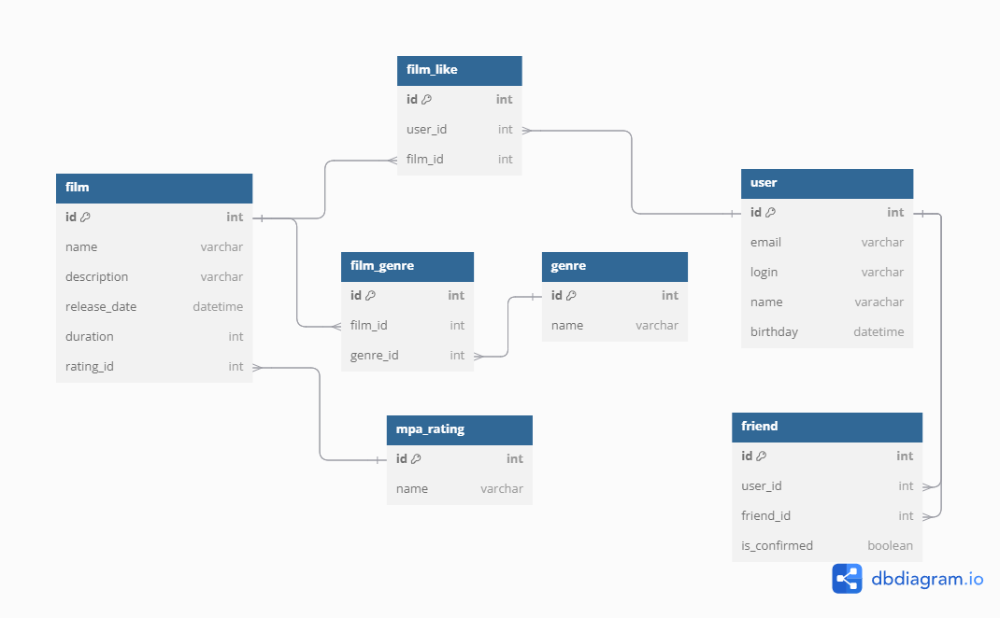

# java-filmorate
Template repository for Filmorate project.


#Примеры некоторых запросов

### Получение всех пользователей

```sql
SELECT *
FROM user;
```

| id | email              | login    | name    | birthday   |
|:---|:-------------------|:---------|:--------|:-----------|
| 1  | ivanov@example.ru  | ivanov   | Иван    | 2000-01-01 |
| 2  | petrov@examole.ru  | petrov   | Виктор  | 1990-10-10 |
| 3  | sidorov@examole.ru | sidorov  | Алексей | 2010-02-02 |   


### Получение всего списка друзей

```sql
SELECT *
FROM user u
JOIN friend f ON u.id = f.user_id;
```

| id | email                | login     | name   | birthday   | id | user\_id | friend\_id | is\_confirmed |
|:---|:---------------------|:----------|:-------|:-----------|:---|:---------|:-----------|:--------------|
| 1  | ivanov@example.ru    | ivanov    | Иван   | 2000-01-01 | 1  | 1        | 2          | true          |
| 2  | petrov@examole.ru    | petrov    | Виктор | 1992-01-29 | 2  | 2        | 1          | true          |


### Получение списка друзей Ивана

```sql
SELECT *
FROM user
WHERE id IN (SELECT f.friend_id
                FROM user u
                JOIN friend f ON f.user_id = u.id
                WHERE u.id = 1);
```

| id | email              | login    | name    | birthday   |
|:---|:-------------------|:---------|:--------|:-----------|
| 2  | petrov@examole.ru  | petrov   | Виктор  | 1990-10-10 |


### Получение фильмов

```sql
SELECT *
FROM film;
```

| id  | name                               | description                                                                                                           | release\_date | duration | rating_id |
|:----|:-----------------------------------|:----------------------------------------------------------------------------------------------------------------------|:--------------|:---------|:----------|
| 1   | Интерстеллар                       | Научно-фантастический фильм о путешествии через черную дыру в поисках новой планеты для человечества.                 | 2014-11-07    | 169      | 1         |
| 2   | Зеленая книга                      | 'История дружбы между афроамериканским пианистом и его итальянским водителем во время тура по югу США в 1960-х годах. | 2018-11-16    | 130      | 2         |


### Получение списка MPAA рейтинга

```sql
SELECT *
FROM mpa_rating
```

| id   | name  |
|:-----|:------|
| 1    | G     |
| 2    | PG    |
| 3    | PG-13 |
| 4    | R     |
| 5    | NC-17 |


### Получение жанров

```sql
SELECT *
FROM genre
```

| id   | name               |
|:-----|:-------------------|
| 1    | Научная фантастика |
| 2    | Драма              |
| 3    | Приключения        |
| 4    | Комедия            |
| 5    | Биография          |